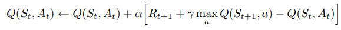
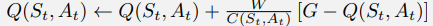
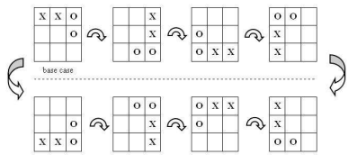
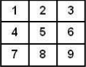

# LAB10

The goal of this lab is to implement a reinforcement learning algorithm to create an agent able to play Tic-Tac-Toe.

## Reinforcement Learning

Different RL methods have been evaluated for the task:

- Q-learning
- Monte Carlo

### Q-learning

For the Q-learning approach, the updated value of the Q-table is computed according to the following formula:

The only modification applied to this formula is that instead of considering the maximum q value for the next state, according to the best action, the minimum is considered. That's because the next state is the state in which the opponent makes the move.  

Based on how the reward system works (the reward considered is the final reward of the episode considered in the following way: win: +1, lose: -1, draw:0), a state will have a positive value if it favors the agent (X player) and a negative value if it favors the opponent (O player).

So by considering the minimum q value for the next state (so the action that is the most favoring for the opponent)  the agent basically makes the assumption that the opponent will make the best move (according to the current policy). 

### Monte Carlo

For the Monte Carlo approach, the updated value of the Q-table is computed according to the following formula:

Where:
- W=1
- G is the final reward of the current episode
- C returns the visit count for state-action pairs

## Results
In the following are reported the results of the agent learned with the previously defined methods:

Agent plays 'X':

| Method      | % won | % lost    | % drawn | size of Q-table|
| :---        |    :----:   |          :---: | :---: | ---: |
| Q-learning      | 0.98749   |  0.0   |  0.01251 | 17K
| Monte Carlo   | 0.98989    | 0.0      |0.01011 | 15K

Agent plays 'O':
    
| Method      | % won | % lost    | % drawn | size of Q-table|
| :---        |    :----:   |          :---: | :---: | ---: |
| Q-learning      | 0.7915   |  0.07761   |  0.13089 | 17K
| Monte Carlo   | 0.76846    | 0.12523     | 0.10631 | 15K

## Symmetries 

Considering Tic-Tac-Toe, different position can be merged into one signle "base case" position (in particular for each position there are 8 different symmetrical positions including the beginning position itself).

The following method is in part borrowed from the paper: "Evolution of No-loss Strategies for the Game of
Tic-Tac-Toe" (https://www.egr.msu.edu/~kdeb/papers/k2007002.pdf).

Starting from a state, all the other symmetrical position are obtained. Now it's needed a way to decide which one is the "base case". First a weight is assigned to each of the 9 postions in the board:

 Then some metrics are used to rank the various possible positions for a state. The metrics used, in order of priority, are:
- the sum of the weights for positions occupied by X
- the sum of weights for positions occupied by O
- the product of weights for positions occupied by X 
- the product of weights for positions occupied by O

So whenever a state is inserted in the Q-table, it is first computed its "canonical" form.

### Results
In the following are reported the results exploiting symmetries:

Agent plays 'X':

| Method      | % won | % lost    | % drawn | size of Q-table|
| :---        |    :----:   |          :---: | :---: |---: |
| Q-learning      |0.91273    |  0.01298     | 0.07429 | 13K
| Monte Carlo   | 0.96667   |   0.00985   |   0.02348| 10K

Agent plays 'O':
        
| Method      | % won      | % lost    | % drawn | size of Q-table|
| :---        |    :----:   |          :---: | :---: | ---: |
| Q-learning      | 0.70938   |  0.00794   |  0.28268 | 13K
| Monte Carlo   | 0.6575    | 0.00293    | 0.33957 | 10K