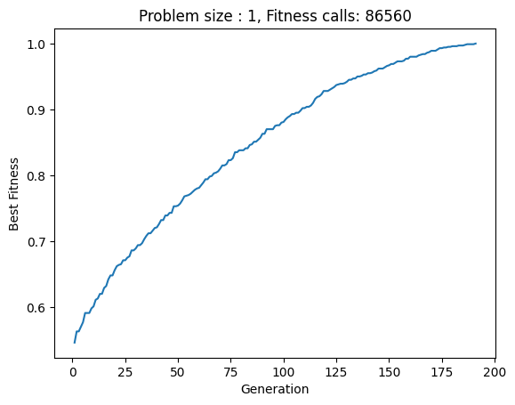
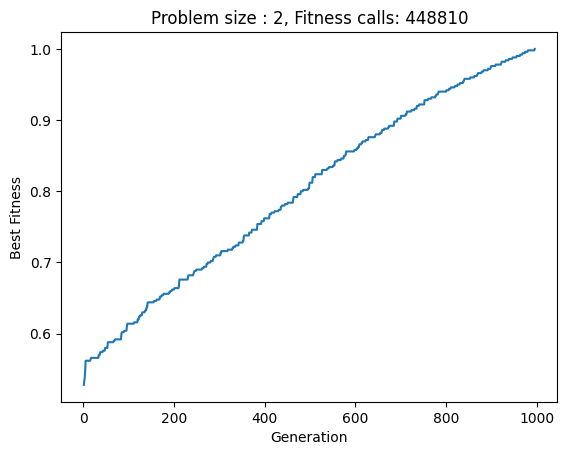
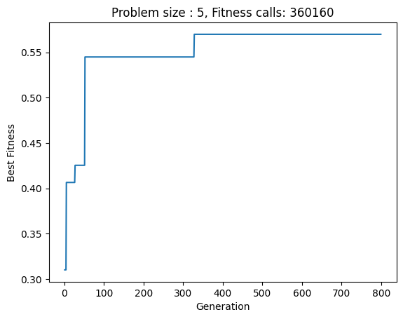
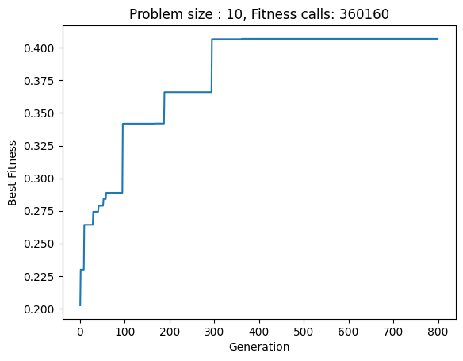

# LAB9 

The goal of this lab is to write a local-search algorithm (eg. an EA) able to solve the Problem instances 1, 2, 5, and 10 on a 1000-loci genomes, using a minimum number of fitness calls.

## Genetic Algorithm

To solve the problem i implemented a **steady-state** genetic algorithm which follows the main step of a GA (parent selection, mutation,crossover,survival selection). 

My GA is steady-state in the sense that the individual of the next generation are selected from both the population and the offspring. Moreover i apply **elitism** since i sort the population (including both the old population and the new offspring) based on the fitness value and then select the `POPULATION_SIZE` fittest individual.

___

### Strategies
Two different strategies have been implemented:

- Crossover `OR` Mutation: apply Crossover with a certain probability otherwise apply mutation;
- Crossover `AND` Mutation: apply Crossover with a certain probability then apply mutation with a certain probability. The possible cases are (C = crossover , M = mutation): `C + M`, `C`, `M`;

For parent selection it has been used a tournament strategy (with parameter `TOURNAMENT_SIZE`): 
- select randomly `TOURNAMENT_SIZE` individuals from the population;
- select as parent the individual with the maximum fitness value.

In the end the Crossovee `AND` Mutation strategy is the one used since it provided the best results.

Different Crossover and mutation strategies have been implemented. The best combination found is: `two_cut_xover` + `mutate_shift`. 

**Note** : even with the simple mutate strategy the results are almost identical.

Moreover, the `MUTATION_PROBABILITY` parameter is adaptive: every 100 generations if the best fitness value doesn't get (relevantly) updated it increases by 10%.

## Results

The parameters used for the obtained results are the following:

```
GENOME_SIZE = 1000
POPULATION_SIZE = 600
OFFSPRING_SIZE = 450
TOURNAMENT_SIZE = 2
MUTATION_PROBABILITY = .3
CROSSOVER_RATE = .8
NUM_GENERATIONS = 3000

```
**Note** : the algorithm stops if it reaches the maximum fitness value (1) or if the best fitness value doesn't get (relevantly) updated in the last 500 generations.

### Problem Instance: 1


### Problem Instance: 2


### Problem Instance: 5


### Problem Instance: 10
